# Network Diagram

```mermaid
graph TB
    subgraph "Internet"
        CLOUD[☁️ Internet/Oracle Cloud]
    end

    subgraph "Tailscale Tailnet"
        direction TB
        TAILSCALE[🔗 Tailscale Mesh Network]
        
        subgraph "Oracle Network"
            ORC[🖥️ Orc<br/>ARM Server<br/>NixOS<br/>Syncthing]
        end
        
        subgraph "Home Network"
            OPNSENSE[🔒 Opnsense<br/>MiniPC N100<br/>Router<br/>Gateway]
            DOBRO[💻 Dobro<br/>Workstation<br/>i7-6700K<br/>64GB RAM<br/>ZFS + Backups]
            ZEEBA[🗄️ Zeeba<br/>Xeon 1U Server<br/>Nextcloud<br/>Coturn<br/>Exit Node]
            PLEX["🔌 Plex<br/>Dell Optiplex<br/>Backup Router<br/>(Offline)"]
        end
        
        subgraph "Berk Network"
            MATCHA[📦 Matcha<br/>MiniPC N100<br/>Offsite Backup<br/>Subnet Router]
            BERKNAS[💾 BerkNAS<br/>NAS<br/>No Tailscale<br/>Routed via Matcha]
        end
        
        subgraph "Lemon Network"
            CHOCO[🍫 Choco<br/>Raspberry Pi 3B<br/>Arch Linux<br/>Backup/Sync]
        end
        
        subgraph "Mobile Devices"
            GALAXYS23[📱 Galaxy S23<br/>Syncthing]
        end
        
        subgraph "Laptops"
            X200[💼 x200<br/>Thinkpad<br/>NixOS]
            NIXAHI[🍎 Nixahi<br/>Apple M1<br/>NixOS Asahi]
            IMPB[💻 impb<br/>Apple i5<br/>NixOS]
            JONODOT[💻 jonodot<br/>Apple M4<br/>OSX]
        end
    end

    %% External Connections
    CLOUD --> ORC

    %% Tailscale Mesh
    ORC -.-> TAILSCALE
    DOBRO -.-> TAILSCALE
    ZEEBA -.-> TAILSCALE
    MATCHA -.-> TAILSCALE
    CHOCO -.-> TAILSCALE
    X200 -.-> TAILSCALE
    NIXAHI -.-> TAILSCALE
    IMPB -.-> TAILSCALE
    JONODOT -.-> TAILSCALE
    GALAXYS23 -.-> TAILSCALE

    %% Home Network Connections
    OPNSENSE --> DOBRO
    OPNSENSE --> ZEEBA
    OPNSENSE --> PLEX

    %% Berk Network Connections
    MATCHA --> BERKNAS

    %% Special Tailscale Routing
    MATCHA -.advertises.-> BERKNAS
    ZEEBA -.exit node.-> TAILSCALE

    %% Backup/Sync Connections
    DOBRO ==|ZFS Syncoid|==> ZEEBA
    DOBRO ==|NFS|==> ZEEBA
    DOBRO ==|CIFS via Matcha|==> BERKNAS

    %% Syncthing Mesh (simplified representation)
    ORC <==|Syncthing|==> DOBRO
    ORC <==|Syncthing|==> CHOCO
    DOBRO <==|Syncthing|==> ZEEBA
    DOBRO <==|Syncthing|==> MATCHA
    DOBRO <==|Syncthing|==> CHOCO
    DOBRO <==|Syncthing|==> GALAXYS23
    ZEEBA <==|Syncthing|==> CHOCO
    ZEEBA <==|Syncthing|==> JONODOT
    MATCHA <==|Syncthing|==> CHOCO
    CHOCO <==|Syncthing|==> GALAXYS23

    %% Styling
    classDef cloud fill:#e1f5fe,stroke:#01579b,stroke-width:2px
    classDef tailscale fill:#f3e5f5,stroke:#7b1fa2,stroke-width:2px
    classDef home fill:#fff3e0,stroke:#e65100,stroke-width:2px
    classDef berk fill:#e8f5e9,stroke:#2e7d32,stroke-width:2px
    classDef lemon fill:#fce4ec,stroke:#c2185b,stroke-width:2px
    classDef mobile fill:#f1f8e9,stroke:#558b2f,stroke-width:2px
    classDef laptop fill:#e0f2f1,stroke:#00695c,stroke-width:2px
    classDef router fill:#ffebee,stroke:#c62828,stroke-width:2px

    class CLOUD cloud
    class TAILSCALE tailscale
    class OPNSENSE,DOBRO,ZEEBA,PLEX home
    class MATCHA,BERKNAS berk
    class CHOCO lemon
    class GALAXYS23 mobile
    class X200,NIXAHI,IMPB,JONODOT laptop
```

## Network Overview

### Networks
- **Home Network**: Protected by Opnsense router, contains Dobro (workstation), Zeeba (server), and Plex (backup router)
- **Oracle Cloud**: Hosts Orc, a cloud server for external services
- **Berk Network**: Offsite location with Matcha (miniPC) and BerkNAS (NAS)
- **Lemon Network**: Contains Choco (Raspberry Pi) for offsite backup
- **Tailscale Tailnet**: Mesh network connecting most hosts across all physical networks

### Key Features

#### Tailscale Integration
- Almost all hosts participate in the Tailscale mesh network
- **Matcha** acts as a subnet router, exposing BerkNAS (192.168.1.0/24) to the tailnet
- **Zeeba** serves as an exit node for the tailnet
- Laptops (x200, Nixahi, impb, jonodot) connect from various locations

#### Backup Strategy
- **Dobro** backs up to Zeeba via ZFS Syncoid (thunderbird_data)
- Dobro mounts BerkNAS via CIFS through Matcha
- Dobro mounts local NAS (Zeeba) via NFS
- Syncthing provides distributed sync across multiple hosts

#### Services by Host
- **Orc**: Syncthing, cloud services
- **Zeeba**: Nextcloud, Coturn (TURN server), Sanoid (ZFS snapshots), Syncthing
- **Dobro**: Syncthing, Sanoid, Syncoid, Duplicati, Steam
- **Matcha**: Syncthing, Tailscale subnet router
- **Choco**: Syncthing

#### Syncthing Devices
The following folders are synced across hosts:
- **common**: Choco, Dobro, Zeeba, Orc, Galaxy S23, jonodot
- **more**: Choco, Dobro, Zeeba, Orc, Matcha, jonodot
- **configs**: Choco, Dobro, Zeeba, Orc, Matcha, jonodot
- **camera**: Dobro, Galaxy S23

### Hardware Summary
- **Servers**: Orc (ARM), Zeeba (Xeon 1U), Matcha (N100 miniPC)
- **Workstations**: Dobro (i7-6700K desktop), x200 (Thinkpad)
- **Laptops**: Nixahi (M1), impb (i5), jonodot (M4)
- **Routers**: Opnsense (N100 miniPC), Plex (Dell Optiplex - offline)
- **Edge Devices**: Choco (Raspberry Pi 3B)
- **Mobile**: Galaxy S23
